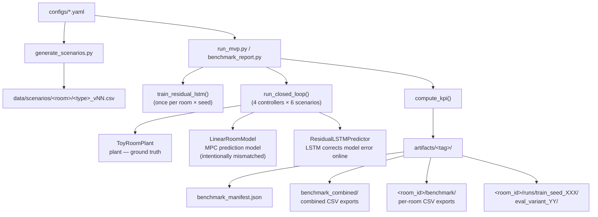

# Hybrid MPC + LSTM Room Heating Control

A simulation framework comparing four heating control strategies on a virtual room model.
The core thesis is that **Hybrid MPC+LSTM** — a Model Predictive Controller augmented with
an LSTM-based residual corrector — outperforms classical baselines on thermal comfort while
maintaining comparable energy consumption.

## Controllers

| Name         | Description                                                         |
|--------------|---------------------------------------------------------------------|
| `onoff`      | Hysteresis bang-bang: full power below band, off above it           |
| `pid`        | PID with conditional-integration anti-windup                        |
| `pure_mpc`   | MPC solving a QP over a receding horizon (no residual correction)   |
| `hybrid_mpc` | MPC with LSTM feedforward correction of model residuals             |

## Architecture



## Quick Start

```bash
# 1. Install
python -m venv .venv
source .venv/bin/activate
pip install -r requirements.txt

# 2. Generate scenario data (run once)
python scripts/generate_scenarios.py --config configs/small_office.yaml --out-dir data/scenarios
python scripts/generate_scenarios.py --config configs/large_office.yaml --out-dir data/scenarios
python scripts/generate_scenarios.py --config configs/meeting_room.yaml --out-dir data/scenarios

# 3. Single smoke run
python scripts/run_mvp.py \
  --config configs/small_office.yaml \
  --scenarios-dir data/scenarios \
  --scenario-variant 0 \
  --seed 42 \
  --no-show

# 4. Full benchmark (all rooms, seeds 40-44, variants 0-3)
python scripts/benchmark_report.py \
  --configs configs/small_office.yaml,configs/large_office.yaml,configs/meeting_room.yaml \
  --scenarios-dir data/scenarios \
  --seeds 40,41,42,43,44 \
  --variants 0,1,2,3 \
  --artifact-root artifacts \
  --experiment-tag final_20260321

# 5. Audit + statistics
python scripts/audit_benchmark.py \
  --configs configs/small_office.yaml,configs/large_office.yaml,configs/meeting_room.yaml \
  --seeds 40,41,42,43,44 --variants 0,1,2,3 \
  --artifact-root artifacts --experiment-tag final_20260321

python scripts/benchmark_statistics.py \
  --artifact-root artifacts --experiment-tag final_20260321 --analysis-unit both

# 6. Tests
pytest -q
```

## Documentation

| File | Contents |
|------|----------|
| [docs/ARCHITECTURE.md](docs/ARCHITECTURE.md) | Component design, data flow, key design decisions |
| [docs/RUNNING.md](docs/RUNNING.md) | Full CLI reference, all script options, troubleshooting |
| [docs/CONFIGURATION.md](docs/CONFIGURATION.md) | YAML config reference, all parameters explained |
| [docs/METRICS.md](docs/METRICS.md) | KPI definitions, statistical methodology, artifact CSV columns |

## Project Layout

```
app/                    core library
  config.py             YAML loading and validation
  controllers.py        OnOff, PID, MPCController, HybridMPCController
  simulation.py         ToyRoomPlant, scenario generation, closed-loop runner
  lstm.py               ResidualLSTM, training pipeline, online predictor
  metrics.py            KPI computation
  scenario_utils.py     scenario CSV validation
  experiment_utils.py   provenance tracking, artifact helpers

scripts/
  generate_scenarios.py
  validate_config.py
  run_mvp.py
  benchmark_report.py
  benchmark_statistics.py
  audit_benchmark.py

configs/                small_office.yaml, large_office.yaml, meeting_room.yaml
data/scenarios/         generated CSV scenario files (90 total)
artifacts/              experiment outputs (gitignored except .gitkeep)
tests/                  pytest suite (5 modules)
docs/                   extended documentation
```
